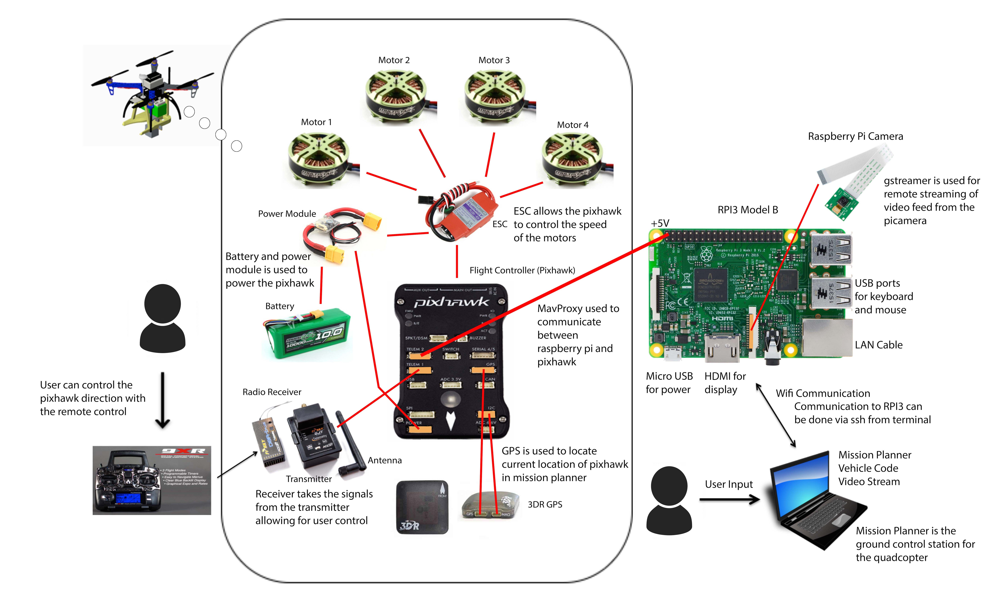
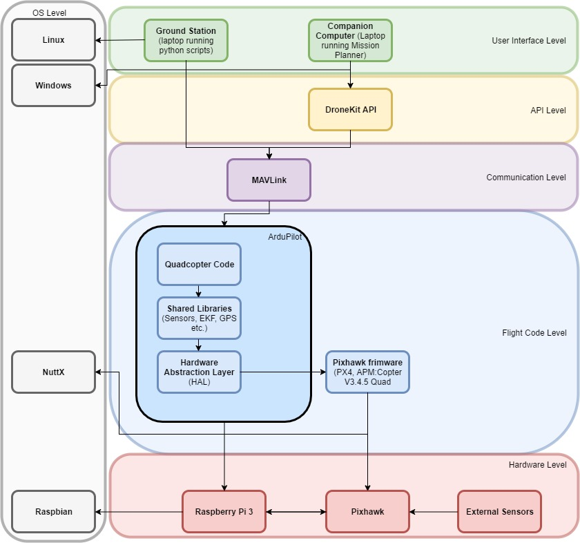
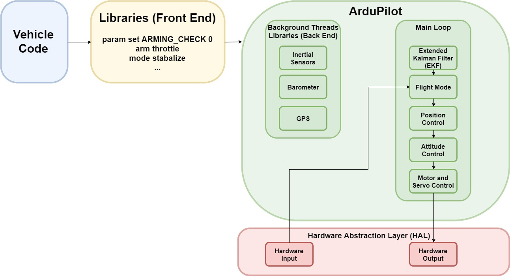

Quadcopter for Lockheed Martin
===================

----------

## Table of Contents

- [Customer](#customer)
- [Problem](#problem)
- [Requirements](#requirements)
- [Summary](#summary)
- [Concept of Operation](#concept-of-operation)
- [Software Design](#software-design)
    - [Source Lines of Code](#source-lines-of-code)
    - [Pre Arm Checks](#pre-arm-checks)
    - [Arming and Takeoff](#arming-and-takeoff)
    - [Taking Off Precautions](#taking-off-precautions)
    - [Landing](#landing)
- [Resources](#resources)

Customer
----------
- Lockheed Martin Team
	- Joseph M. Grozio and Daniel Sturniolo
- US Military (Customer for Lockheed Martin)
- Dr. Andrew Olewnik

----------

Problem
-------------

The customer is asking for an innovative solution on how to efficiently use a dual quadcopter system to pick up and release a payload to a specific drop zone using a remote lasing system
  > - One quadcopter will have the lasing system attached while the other will identify the target and carry the payload to the target
  > - This mission must be completed safely
  > - Within a budget of $1,200
  > - Must be completed before May 12th

----------
Requirements
-------------------
| Technical Specifications | Brief Description |
| :------------------------:| :-----------------: |
| Quadcopter is able to fly a two pound payload | Payload amount set by customer along with other weight |
| Deliver payload with no damage to materials    | The payload must be delivered from pick up point to drop zone with no change in condition |
| Deliver payload in two square feet drop zone     | Quadcopter must deliver payload in specified drop zone by customer |
| Identification system locates correct drop zone | Drop zone must be accurately identified by lasing system connected on 2nd quadcopter |
| 10 minute fly time | Requirement given by engineering team |
| Budget of $1200 | Set by customers, any additional expenses is from engineering team |
| Deadline 05/12/2017 | Final prototype should be delivered by this date |

----------

Summary
-------------

- Custom built design for our payload quadcopter
- Commercial purchased drone (SYMA X8C) for our locating quadcopter outfitted with a beacon
- System will solve the problem using the following steps:
	- An operator remotely picks up the payload using the payload quadcopter
	- A second operator remotely operates the locating quadcopter to identify the drop-zone
	- The locating quadcopter is outfitted with a beacon that will allow for the location to be picked up using
a sensor on the payload quadcopter
	- The payload quadcopter will then fly with the payload to the location picked up from the sensor
	- Once arriving at the drop-zone location the payload quadcopter will release the payload within the
specified zone
- Attachment mechanism was custom designed and 3D printed
	- Functions by using a linear gearbox that transfers the radial motion of a servo motor to linearly extend
an arm that will enclose a module attached to the payload into a cavity
	- This is done remotely and assisted by the use of a live video stream
	- To release the payload at the drop-zone the operator remotely releases the linear arm
- A laptop will serve as the Ground Station (GS) and SSH into the raspberry pi
	- Allows remote access to raspberry pi
	- Will be able to remotely activate the camera and stream live video
	- Will be running Mission Planner
	- Full-featured application for ArduPilot, an open source autopilot project
	- Graphically view all the drone’s telemetry information in GUI

----------

Concept of Operation
--------------------

**Figure 1** Identifying quad copter with beacon attached to top, used for identifying drop zone

**Figure 2** Main delivery drone

**Figure 3** Attachment Mechanism

**Figure 4** How payload will engage with the attachment mechanism

**Figure 5** Live feed seen to attach payload

**Figure 6** Payload being attached by switching on motor

Software Design
---------------

**Figure 7 Network Diagram**

**Figure 8 Interface Design Description**

**Figure 8 Ardupilot software block diagram**

**Figure 9 Take Off Software Block Diagram**

### Source Lines of Code
#### Pre-arm Checks
Arming the vehicle turns on the motors for the Copter, however before arming it needs to go through pre-arm checks which includes checking for a GPS lock, and an Extended Kalman Filter (EKF) algorithm to estimate vehicle position, velocity and angular orientation based on rate gyroscopes, accelerometer, compass, GPS, airspeed and barometric pressure measurements

    print "Basic pre-arm checks"
    #Don't let the user try to arm until autopilot is ready
    while not vehicle.is_armable:
	    print " Waiting for vehicle to initialise..."
	    time.sleep(1)

#### Arming and takeoff
Once the vehicle has passed the pre-arm checks, and is_armable returns true, we can then set the vehicle mode to GUIDED, and wait till the motors have been completely armed before taking off

	print "Arming motors"
    #Copter should arm in GUIDED mode
    vehicle.mode = VehicleMode("GUIDED")
    vehicle.armed = True
    while not vehicle.armed:
	    print " Waiting for arming..."
	    time.sleep(1)
    print "Taking off!"
    vehicle.simple_takeoff(aTargetAltitude) 
    #Take off to target altitude

#### Taking off precautions 
The takeoff command is asynchronous and can be interrupted if another command arrives before it reaches the target altitude. This could have potentially serious consequences if the vehicle is commanded to move horizontally before it reaches a safe height. To address these issues, the function waits until the vehicle reaches a specified height before returning.

	 while True:
	     print " Altitude: ", vehicle.location.global_relative_frame.alt
		 #Break and return from function just below target altitude.
		 if vehicle.location.global_relative_frame.alt>=aTargetAltitude*0.95:
		     print "Reached target altitude"
		     break
	     time.sleep(1)

#### Landing 
The landing command is taken care off by the dronekit api, this can be initiated in two ways, if we want to land at the current position the drone is we set the mode to LAND, otherwise if we want it land where we started the mission, set the mode to RTL, at the end we need to make sure that the script closes the vehicle and shuts off all the motors

    #The example is completing. LAND at current location.
    print("Setting LAND mode...")
    vehicle.mode = VehicleMode("LAND")
    #The example is going back to home location and landing
    print("Setting RTL mode...")
    vehicle.mode = VehicleMode("RTL")
    #Close vehicle object before exiting script
    print "Close vehicle object"
    vehicle.close()
  
## Resources 
[Drone Kit](http://python.dronekit.io)
